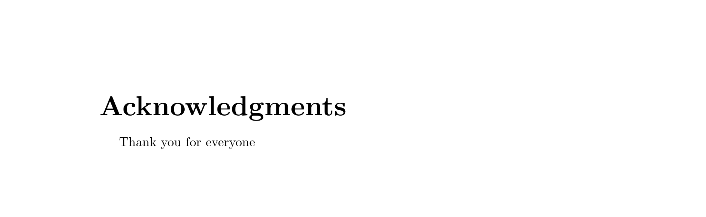
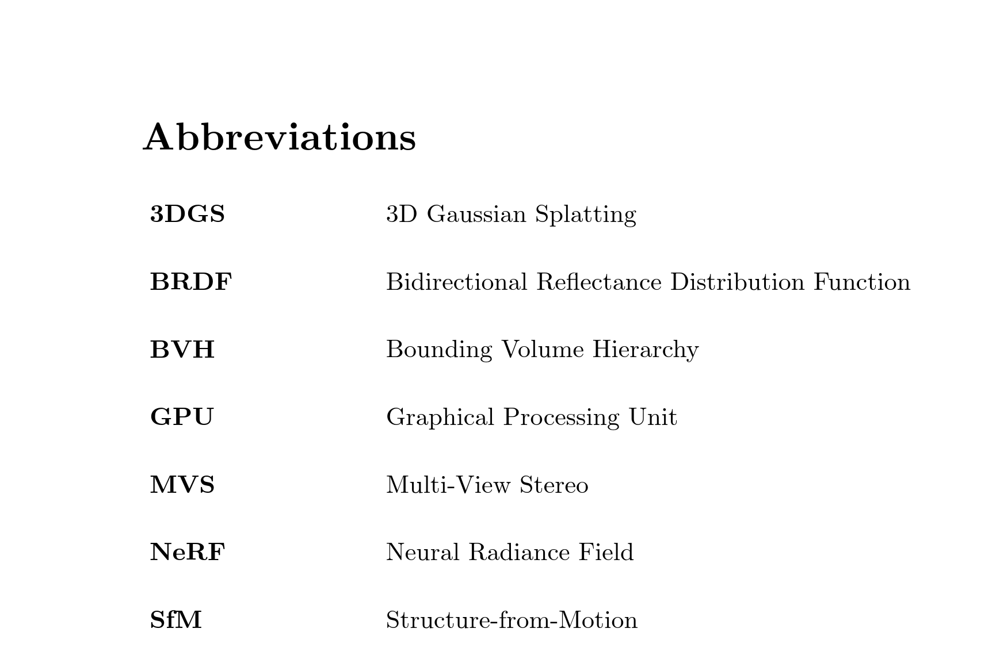
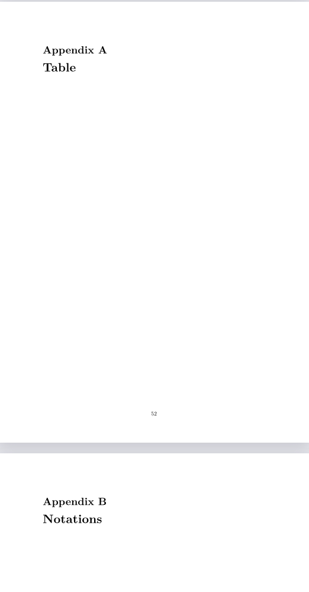
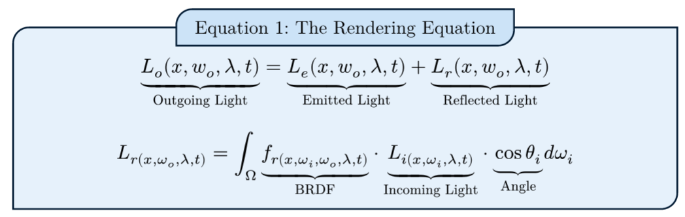

# master-thesis-template-typst-ulb

Hello, this is my template for the master thesis at ULB in typst.

There is an example of this template and what it renders in example.pdf (with the corresponding code in example.typ)

To use it, you only need to download the template.typ and download the image of the ulb logo on the website of the master thesis.

Then, in your main.typ, you need to put this at the beginning of your file:

```typ
#import "template.typ": *
#show: doc => styling(doc) // to modify the font, the margins and all that stuff
#title_page(author: "Author of the thesis", advisor: "Advisor", promotor: "Promotor", title: "Your title") // the front page
#outline(title: text(size: 1.5em, font: "New Computer Modern")[Contents], indent: auto) // the outline
#pagebreak()
```

## Acknowledgments

```typ
#acknowledgments()[
  Thank you for everyone
]
```



## Abbreviations

```typ
#abbreviations()[
  \
#{
  show table.cell: set text(15pt)
  show table.cell.where(x: 0): set text(weight: "bold")
  table(
  columns: (20%, 80%),
  stroke: none,
  column-gutter: 5em,
  row-gutter: 1.8em,
  [3DGS], [3D Gaussian Splatting],
  [BRDF], [Bidirectional Reflectance Distribution Function],
  [BVH], [Bounding Volume Hierarchy],
  [GPU], [Graphical Processing Unit],
  [MVS], [Multi-View Stereo],
  [NeRF], [Neural Radiance Field],
  [SfM], [Structure-from-Motion],
)
}
]
```



## Appendix


```typ
#appendix[
  = Table


  = Notations
]

```

## Equations

I also made a function to make equations easy:

```typ
#equation(
  "The Rendering Equation", // title of the equation
  [$ underbrace(L_o (x, w_o, lambda, t), "Outgoing Light") = underbrace(L_e (x, w_o, lambda, t), "Emitted Light") + underbrace(L_r (x, w_o, lambda, t), "Reflected Light") $ 
      $ L_r(x, omega_o, lambda, t) = integral _Omega underbrace(f_r(x, omega_i, omega_o, lambda, t), "BRDF") dot.c underbrace(L_i(x, omega_i, lambda, t), "Incoming Light") dot.c underbrace(cos theta_i, "Angle") d omega_i $], // the equation
    lab: "eqt:rendering_eqt" // the label of the equation for reference
) 

```

Rendering of the equation:




